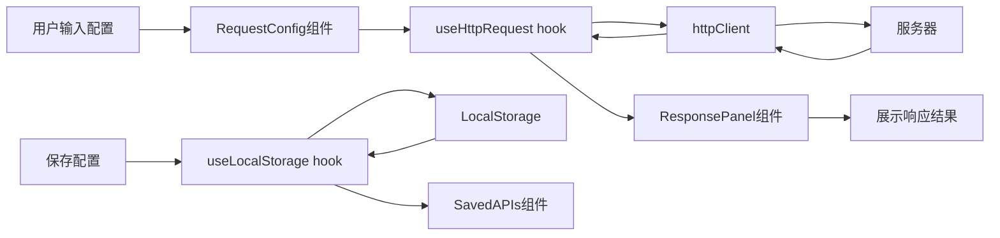
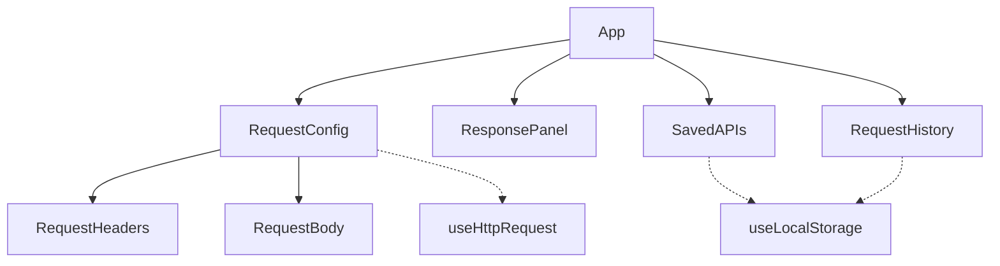

# HTTPS请求测试页面 - 技术架构文档

## 1. 技术选型

### 1.1 前端框架
- **框架**: React 18
- **语言**: TypeScript
- **构建工具**: Vite
- **样式**: TailwindCSS 3
- **图标**: Lucide React

### 1.2 核心依赖
- `axios`: HTTP客户端，支持HTTPS请求
- `react-json-view`: JSON格式化展示
- `localforage`: 本地存储管理

## 2. 架构设计

### 2.1 模块划分
- **components/**: UI组件
  - `RequestConfig.tsx`: 请求配置组件
  - `RequestHeaders.tsx`: 请求头配置组件
  - `RequestBody.tsx`: 请求体编辑组件
  - `ResponsePanel.tsx`: 响应展示组件
  - `SavedAPIs.tsx`: 已保存接口列表组件
  - `RequestHistory.tsx`: 请求历史组件
- **hooks/**: 自定义hooks
  - `useHttpRequest.ts`: HTTP请求逻辑hook
  - `useLocalStorage.ts`: 本地存储hook
- **types/**: 类型定义
  - `index.ts`: 接口类型定义
- **utils/**: 工具函数
  - `httpClient.ts`: HTTP客户端封装
- **App.tsx**: 主应用组件
- **main.tsx**: 入口文件

### 2.2 数据流


### 2.3 组件关系


## 3. 接口设计

### 3.1 请求配置接口
```typescript
interface RequestConfig {
  url: string;
  method: 'GET' | 'POST' | 'PUT' | 'DELETE' | 'PATCH';
  headers: Record<string, string>;
  body: string;
  timeout: number;
}
```

### 3.2 响应数据接口
```typescript
interface ResponseData {
  status: number;
  statusText: string;
  headers: Record<string, string>;
  body: unknown;
  time: number;
}
```

### 3.3 保存的接口配置
```typescript
interface SavedAPI {
  id: string;
  name: string;
  config: RequestConfig;
  createdAt: number;
}
```

### 3.4 请求历史记录
```typescript
interface RequestHistory {
  id: string;
  config: RequestConfig;
  response: ResponseData | null;
  timestamp: number;
}
```

## 4. API调用

### 4.1 HTTP请求封装
- 使用axios封装HTTP请求
- 支持GET/POST/PUT/DELETE/PATCH方法
- 支持自定义请求头
- 支持超时配置
- 支持取消请求

### 4.2 本地存储API
- 保存接口配置到localStorage
- 读取已保存的接口配置
- 删除接口配置
- 保存请求历史

## 5. 部署方案

### 5.1 开发环境
```bash
npm install
npm run dev
```

### 5.2 生产构建
```bash
npm run build
```

### 5.3 静态资源部署
- 构建产物位于 `dist/` 目录
- 可部署至任何静态文件服务器
